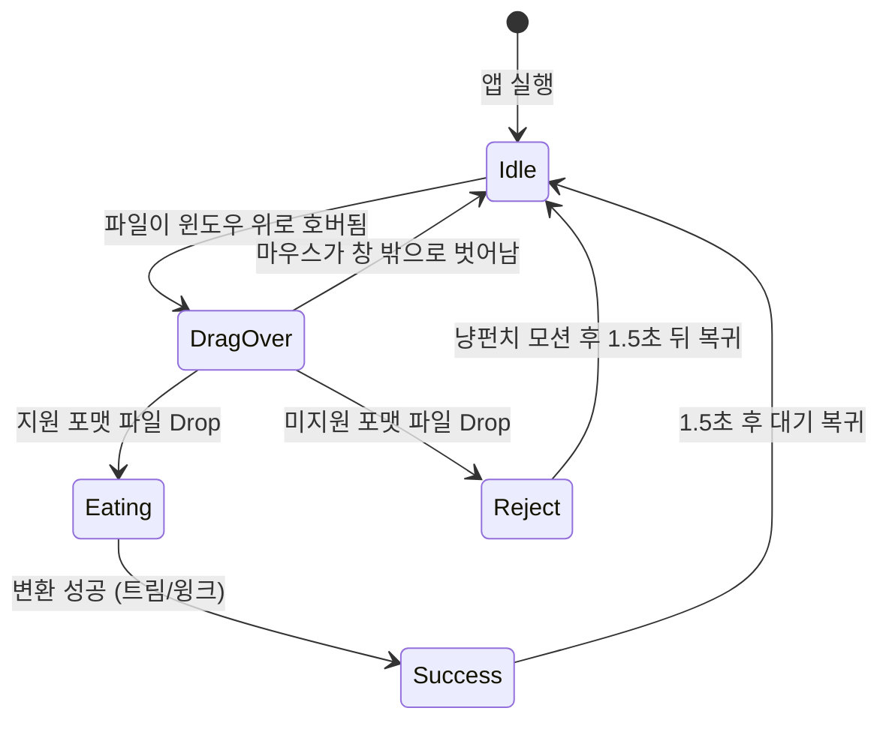

# [PRD] Neko Suite: 4종 고양이 테마 초경량 데스크톱 유틸리티

> **문서 버전**: v1.0.0  
> **대상 플랫폼**: Windows 10 / 11 (Portable `.exe` 및 `.msi`)  
> **공통 기술 스택**: Tauri v2 + Rust Backend + Vite / TypeScript / Tailwind CSS Frontend  
> **핵심 가치**: 압도적 경량성(RAM < 20MB, 기동 < 0.2초), 100% 오프라인 로컬 처리, 사랑스러운 고양이 인터랙션

---

## 1. 공통 아키텍처 및 비기능적 요구사항

```
+-----------------------------------------------------------------------+
|                              Neko Suite                               |
|   [Neko Drop]       [Neko Punch]     [Bongo Format]     [Purr Focus]  |
+-------------------+----------------+------------------+---------------+
| Frontend Layer    : React / Vite / TypeScript + Tailwind CSS / Canvas |
| IPC / Event Layer : Tauri v2 Core IPC (Async Commands / Events)        |
| Backend Layer     : Rust (Polars, Sysinfo, Arboard, Windows API)     |
| Packaging         : Single Portable Executable (.exe) / WiX (.msi)    |
+-----------------------------------------------------------------------+
```

### 1.1 핵심 비기능 요구사항
1. **초경량 메모리 및 자원 효율성**:
   - 백그라운드 유휴(Idle) 시 RAM 점유율 **20MB 이하** 유지.
   - 바이너리 실행 시 메인 윈도우/팝업 기동 속도 **0.2초(200ms) 미만**.
2. **보안 및 프라이버시**:
   - 외부 서버와의 통신 **0% (완전 오프라인 격리)**.
   - 모든 데이터 변환, 클립보드 파싱, 프로세스 제어는 로컬 메모리 및 디스크 상에서만 안전하게 수행.
3. **단일 포터블 패키징**:
   - 별도 런타임(Node.js, Python 등) 설치 없이 단일 실행 파일(`.exe`)로 즉시 동작.

---

## 2. 개별 앱 상세 기능 명세서 (PRD)

---

### App 1. Neko Drop (초고속 파일 먹방 변환기)

#### 1. 개요
- **한 줄 정의**: 복잡한 설정창 없이 대용량 데이터 파일을 드래그 앤 드롭하면 고양이가 먹고 초고속으로 다른 포맷으로 소화(변환)해 뱉어내는 로컬 유틸리티.
- **주요 타깃**: 대용량 데이터(CSV, Parquet, JSON 등)를 다루는 데이터 엔지니어, 퀀트 분석가, 백엔드 개발자.

#### 2. 사용자 인터랙션 & 상태 머신


- **상태별 시각 & 청각 피드백**:
  - `Idle (대기)`: 고양이가 졸거나 주위를 두리번거림 (CSS Sprite / 2D Canvas 2~3프레임 루프).
  - `DragOver (드래그 오버)`: 마우스가 드롭존 진입 시 입을 크게 벌리고 눈을 반짝이며 기대.
  - `Eating (변환 중)`: 파일을 떨어뜨리면 포맷별 사운드(바삭, 챱챱, 호로록)와 함께 "우걱우걱" 씹는 모션 (0.5~1.0초).
  - `Success (완료)`: "꺼억(트림)" 또는 "윙크" 모션과 함께 원본 파일 경로와 동일한 위치에 변환 파일 저장 완료 메시지 출력.
  - `Reject (미지원)`: 냄새를 킁킁 맡고 뒷걸음질 치며 화면 밖으로 냥펀치로 쳐냄.

#### 3. 포맷 변환 매핑 및 변환 엔진
| 입력 포맷 | 기본 출력 포맷 | 대체 선택 포맷 | 변환 처리 엔진 (Rust) |
|---|---|---|---|
| `.csv` | `.parquet` (Snappy 압축) | `.json` / `.jsonl` | `polars::prelude::*` (LazyFrame 활용) |
| `.parquet` | `.csv` | `.json` | `polars::prelude::*` |
| `.json` / `.jsonl` | `.csv` (정렬/평탄화) | `.parquet` | `serde_json` + `polars` |
| `.xlsx` | `.sqlite` (`.db`) | `.csv` | `calamine` (Sheet 스트리밍 파싱) |
| `.sqlite` / `.db` | `.parquet` / `.csv` | - | `rusqlite` / `duckdb` (선택) |

#### 4. 기술 스펙
- **Rust Crates**: `tauri = "^2.0"`, `polars = { version = "0.40", features = ["parquet", "lazy", "json"] }`, `calamine = "0.24"`, `serde_json = "1.0"`
- **Frontend**: HTML5 Drag and Drop API, Tailwind CSS, Web Audio API (합성음/경량 사운드), Canvas Sprite Player.

---

### App 2. Neko Punch (냥펀치 포트/프로세스 킬러)

> **구현 상태**: ✅ **v0.2.0 배포 완료** (단일 포터블 `portable/Neko Punch.exe`)

#### 1. 개요
- **한 줄 정의**: 로컬 개발 중 8080, 3000 등 포트가 충돌했을 때, 클릭 한 번으로 고양이 펀치를 날려 해당 프로세스를 즉시 강제 종료하고, 원하는 포트를 직접 등록해 모아볼 수 있는 시스템 유틸리티.
- **주요 타깃**: 백엔드/웹 개발자, 로컬 테스트 서버를 빈번하게 실행/중단하는 엔지니어.

#### 2. 핵심 기능 및 워크플로우
1. **점유 포트 실시간 스캔**:
   - 현재 OS의 `TCP LISTEN` 상태인 모든 충돌 포트, 실행 파일명(`node.exe`, `python.exe` 등), PID, 메모리 점유량(MB) 고속 분석.
2. **사용자 정의 '내 포트 ⭐' 커스텀 관리**:
   - 상단 탭: `전체` / `웹 개발` / `DB` / **`⭐ 내 포트`**
   - 원하는 포트 번호 직접 입력 추가 (`+ 추가`) 및 포트 행의 별표(⭐) 핀 버튼으로 원클릭 등록/해제.
   - 로컬스토리지(`LocalStorage`)를 통해 등록 포트 영구 보존.
3. **냥펀치 킬(Punch/Kill) 인터랙션**:
   - 프로세스 항목의 `[냥펀치 🐾]` 버튼 클릭.
   - OS 레벨에서 0.05초 만에 즉각 강제 종료 (`taskkill /F /T /PID <pid>`).
   - 화면에서는 하트 젤리 솜방망이 냥펀치가 1.8초 동안 머물며 핑크빛 하트(`💖`), 별가루(`✨`), `냥! 🐾` 말풍선 팝핑 쇼 연출.
   - 찰진 마시멜로 젤리 뽁! + 솜방망이 타격음 + 귀여운 냥! 합성 사운드 재생.
4. **시스템 트레이 & 윈도우 조작**:
   - 최소화(`-`) 및 완전 종료(`X`) 즉각 지원.
   - 백그라운드 트레이 상주 및 트레이 아이콘 좌클릭 토글 / 우클릭 메뉴 지원.

#### 3. 기술 스펙
- **Rust Crates**: `tauri = "^2.0"`, `sysinfo = "0.31"`, `regex`, Windows API.
- **Frontend**: React 18, TypeScript, Tailwind CSS, Web Audio API 사운드 신디사이저, 고해상도 고양이 투명 PNG 그래픽 에셋.
- **패키징**: 단일 무설치 포터블 `.exe` (~7.4MB) 및 `.msi` 인스톨러.

---

### App 3. Bongo Format (봉고캣 클립보드 데이터 뷰어)

> **구현 상태**: ✅ **v0.3.0 배포 완료** (단일 포터블 `portable/Bongo Format.exe`)

#### 1. 개요
- **한 줄 정의**: 복사한 텍스트가 정렬되지 않은 JSON, 난독화된 SQL, 지저분한 CSV일 때 단축키를 누르면 봉고캣이 키보드를 두드리며 깔끔한 테이블 및 서식화된 뷰로 즉시 서빙하는 툴.
- **주요 타깃**: API 디버깅, 로그 분석, 쿼리 작성을 자주 수행하는 풀스택/백엔드 개발자.

#### 2. 핵심 기능 및 뷰어 모드
1. **클립보드 자동 인식 & 팝업 호출**:
   - 글로벌 단축키(`Alt + Space` 또는 `Ctrl + Shift + V`) 입력 시 즉시 최상위 팝업.
   - 클립보드 버퍼를 고속 분석하여 데이터 유형 자동 판별:
     - `{...}` 또는 `[...]` 패턴 $\rightarrow$ **JSON 모드**
     - `SELECT`, `INSERT`, `UPDATE`, `WITH` 키워드 $\rightarrow$ **SQL 모드**
     - 쉼표/탭 구분 다중 라인 $\rightarrow$ **CSV 모드**
     - 기타 $\rightarrow$ **일반 텍스트/마크다운 모드**
2. **봉고캣 인터랙션**:
   - 뷰어 상단에 귀여운 봉고캣이 위치.
   - 포맷팅/파싱 연산이 수행되는 동안 양손을 교대로 빠르게 두드리는 애니메이션과 경쾌한 타자기/기계식 키보드 효과음 재생.
3. **모드별 뷰어 기능**:
   - **JSON Mode**: 접기/펼치기 지원 인터랙티브 트리 뷰, Key-Value 필터링, 스프레드시트 2D 테이블 변환, 1클릭 복사.
   - **SQL Mode**: 키워드 대문자화, 서브쿼리 인덴트 정렬, 구문 하이라이팅.
   - **CSV Mode**: TanStack Table 기반 가상 스크롤 렌더링 (수만 행 데이터도 버벅임 없이 즉시 정렬/검색 지원).

#### 3. 기술 스펙
- **Rust Crates**: `tauri`, `arboard = "3.4"` (OS 클립보드 제어), `serde_json`, `sqlformat = "0.2"`
- **Frontend**: `@tanstack/react-table` (가상화 테이블), `@monaco-editor/react` 또는 경량 코드 뷰어 (`PrismJS` / `Shiki`), 봉고캣 SVG/Canvas 스프라이트.

---

### App 4. Purr Focus (꾹꾹이 데스크톱 펫 & 포모도로 타이머) `✅ v0.4.0 배포 완료`

#### 1. 개요
- **한 줄 정의**: 모니터 화면 구석/작업표시줄 위에 조용히 상주하며 25분 집중과 5분 휴식을 케어하고, 스트레칭을 유도하는 투명 배경 데스크톱 펫.
- **주요 타깃**: 장시간 코딩과 문서 작업으로 거북목과 눈의 피로에 시달리는 개발자 및 프리랜서.
- **배포 바이너리**: `portable/Purr Focus.exe` (~4.5MB, 단일 포터블 실행 파일)

#### 2. 핵심 기능 및 상태별 고양이 행동
```
[ 25분 집중 모드 ]               [ 5분 휴식 모드 ]
 - 투명 배경 / Always-on-Top       - 화면 중앙/상단으로 슬금슬금 이동
 - 식빵 굽기 / 새근새근 수면        - 앞발로 화면 긁기 / 꾹꾹이 모션
 - 방해 없는 미니멀 상태            - 골골송(Purring) 사운드 + 알림 말풍선
                                    ("집사야 스트레칭 30초! 물 마셔라!")
```

1. **투명 프레임리스 윈도우 (Click-Through 지원)**:
   - 배경이 완전 투명한 프레임리스 윈도우(`decorations: false`, `transparent: true`, `always_on_top: true`).
   - 기본 상태에서는 마우스 클릭을 투과(Click-Through)시켜 작업에 간섭하지 않음. 단축키나 특정 모드에서 위치 드래그 이동 가능.
2. **포모도로 사이클 & 꾹꾹이 인터랙션**:
   - **집중 세션 (25분)**: 고양이가 모니터 구석에서 조용히 식빵을 굽거나 자고 있음.
   - **휴식 세션 (5분)**: 화면 중앙으로 다가와 앞발을 번갈아 누르는 꾹꾹이 모션과 함께 저주파 골골송(골골골...) 오디오 재생.
   - 피로 회복 유도 말풍선: "목을 뒤로 젖히고 10초 스트레칭하세요!", "물 한 잔 마실 시간!"
3. **펫 터치 인터랙션**:
   - 마우스 호버 시 눈을 가늘게 뜨며 가르랑거림.
   - 더블 클릭 시 타이머 일시정지 / 즉시 휴식 전환 메뉴 팝업.

#### 3. 기술 스펙
- **Rust Crates**: `tauri` (Transparent Window, WS_EX_TRANSPARENT 클릭 투과 플래그 제어), Rust 백그라운드 타이머 스레드.
- **Frontend**: 투명 Webview, 픽셀 아트 고양이 스프라이트 렌더러, Web Audio API (골골송 / 윈도우 알림음).

---

## 3. AI 에이전트 개발 지시용 프롬프트 템플릿

AI 코딩 에이전트에게 개별 앱 또는 통합 스위트를 지시할 때 아래 프롬프트를 복사하여 전달합니다.

### 📋 AI 에이전트 마스터 프롬프트 (Master Prompt Template)

```markdown
당신은 Tauri v2와 Rust, 그리고 모던 프론트엔드(React/TypeScript/Tailwind CSS) 전문가입니다.
아래 명세서에 정의된 [앱 이름] 데스크톱 애플리케이션을 구현하십시오.

[핵심 구현 원칙]
1. 성능 우선: 백그라운드 유휴 메모리 20MB 이하, 기동 시간 200ms 미만을 달성해야 합니다.
2. 100% 로컬 오프라인: 외부 네트워크 호출 코드를 일절 포함하지 마십시오.
3. 귀여운 고양이 인터랙션: 상태 머신에 따른 애니메이션과 사운드(Web Audio API)를 완성도 높게 구현하십시오.
4. Windows 환경 최적화: 단일 실행 파일(.exe)로 빌드 가능한 형태로 Tauri 프로젝트 구조를 작성하십시오.

[세부 명세서]
(위 PRD 문서의 해당 앱 섹션을 그대로 전달)
```

---

## 4. 프로젝트 디렉토리 권장 구조 (Monorepo / Multi-App)

```
desktop_app/
├── PRD.md                       # 전체 PRD 통합 문서
├── README.md                    # 프로젝트 가이드
├── apps/
│   ├── neko-drop/               # 1. 파일 변환기 (Tauri + Polars)
│   │   ├── src-tauri/
│   │   └── src/
│   ├── neko-punch/              # 2. 포트/프로세스 킬러 (Tauri + Sysinfo)
│   │   ├── src-tauri/
│   │   └── src/
│   ├── bongo-format/            # 3. 클립보드 뷰어 (Tauri + Arboard + TanStack)
│   │   ├── src-tauri/
│   │   └── src/
│   └── purr-focus/              # 4. 포모도로 펫 (Tauri Transparent Window)
│       ├── src-tauri/
│       └── src/
└── shared/
    ├── assets/                  # 공통 고양이 스프라이트, 사운드 에셋
    └── ui/                      # 공통 컴포넌트 라이브러리
```
